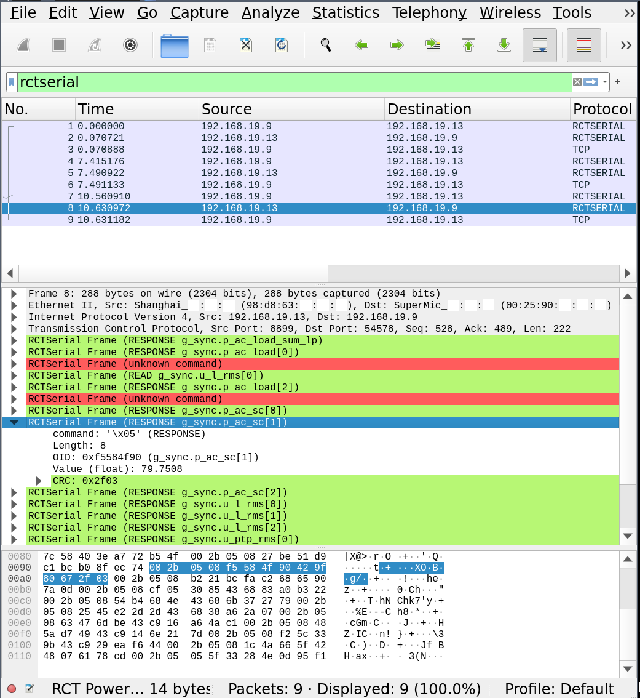

# Wireshark dissector for RCT Serial Communication Protocol - Proof of Concept

The code in this repository is an experimental protocol dissector for the RCT Serial Communication Protocol by RCT Power GmbH for use with Wireshark.

*This is a Proof of Concept (PoC)*

I will not pursue the project further myself, though I'll most likely accept PRs. I am not fluent in LUA, getting this state to work was enough of a challenge for me and taught me that I'm better off with writing my own special-purpose tools ([python-rctclient](https://github.com/svalouch/python-rctclient/)).

The dissector uses the LUA API to interface with Wireshark. It contains a hardcoded list of OIDs extracted from the `Registry` of [python-rctclient](https://github.com/svalouch/python-rctclient/).

## Installation

On Linux, drop the `*.lua`-files into `${HOME}/.local/lib/wireshark/plugins/`. You may need to tell Wireshark to use the dissector by right-clicking on a TCP-Frame and setting up port `8899` to be dissected as `rctserial`. Once this is working, you can simply filter for `rctserial` and expand the packet contents.

## Bugs

- Slow (probably my fault, but could be the LUA API as well)
- Buggy
- The CRC calculation is not working and checksum mismatches are ignored.
- Corner cases are ignored, such as packets that indicate a far too large payload.
- Frames spanning multiple TCP packets are not handled.

## Files
- `rctdata.lua` contains the OID information (generated file).
- `rctserial.lua` is the actual dissector.
- `rctutils.lua` contains helper functions.

## Example

